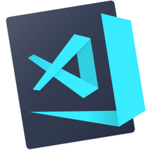
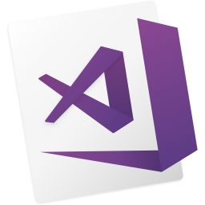
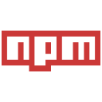

<!--
**thisfardi/thisfardi** is a ✨ _special_ ✨ repository because its `README.md` (this file) appears on your GitHub profile.


Here are some ideas to get you started:


- 🔭 I’m currently working on ...
- 🌱 I’m currently learning ...
- 👯 I’m looking to collaborate on ...
- 🤔 I’m looking for help with ...
- 💬 Ask me about ...
- 📫 How to reach me: ...
- 😄 Pronouns: ...
- ⚡ Fun fact: ...
-->


<h1 align="left">
  <a href="https://git.io/typing-svg">
    
  </a>
</h1>


### I'm a Computer Science and Engineering

- 🔭 I’m currently working on Web development technologies
- 🌱 I’m currently learning Bootstrap, PHP, HTML, Python, Java
- 👯 I’m looking to collaborate on your Open Source Project
- ⚡ Fun fact: It's not healthy, but i love chocolate so much


### Spotify Playing 🎧
<!--[](https://spotify-github-profile.vercel.app/api/view?uid=3k5y2ces5jd1d2w0g08kct5ri&redirect=true)-->
[](https://spotify-github-profile.vercel.app/api/view?uid=mh8vqpv844kthenz2y766woot&redirect=true)
<p align="center"> 
  Visitor count<br>
  
</p>

<details>
  <summary><b>My Github Stats</b></summary>
  
  
</details>

<details>
  <summary><b>Connect with me</b></summary>
  <p align="center">
    <i>Let's connect and chat! We are about to Change the World.</i><br><br>
    <a href="https://twitter.com/n1ghtpe0ple420" target="blank"></a>
    <a href="https://linkedin.com/in/rakka-pratama-74612718b" target="blank"></a>
    <a href="https://fb.com/n1ghtpe0ple420" target="blank"></a>
    <a href="https://instagram.com/putra.go.id" target="blank"></a>
    <a href="https://www.youtube.com/c/ucz44r-0tngtx0bjmmejeb4q" target="blank"></a>
  </p>
</details>
<hr>
<h2 align="center">👨🏽‍💻 Languages & Frameworks & Tools 👨🏽‍💻</h2>
<br>
<p align="center">
  <code></code>
  <code></code>
  <code></code>
  <code></code>
  <code></code>
  <code></code>
  <code></code>
  <code></code>
  <code></code>
  <code></code>
  <code></code>
  <code></code>
  <code></code>
  <code></code>
  <code></code>
  <code></code>
  <code></code>
  <code></code>
  <code></code>
</p>

<div align="center">

### Show some ❤️  by starring ⭐️ some of the repositories!

</div>

```javascript
const name = 'This Fardi';
document.write("Hello, Everybody");

var status = 
{ 
  learning : [JavaScript,Python,Blockchain, HTML, JAVA, CSS],
  interests: [Research, Open Source Contribution, Business Analytics]
}

const skills = 
{
  languages :[Svelte, Bash, Aurelia, PHP, JavaScript, Julia, Rust, Git, Markdown, VB],
  
  ide       :[Vs Code, GitHub Codespace, GitPod, Netbeansm Android Studio],
  
  frameworks:[Bootstrap, Sharepoint Framework, NodeJs],
  
  platforms :[Google Cloud Platform, Buildkite, Heroku, Netlify, Firebase, Cloudflare],
  
  cicd      :[Github Workflows, Jenkins, Gerrit Code Review],

  softwares :[Microsoft PowerBi, Microsoft Access, Rapid Miner, Vegas Pro]
}

Developer dev = new Developer(thisfardi);

while(dev.isCoding() && dev.isStuck())  
{
  dev.openBrowser();
  dev.openStackOverFlow();
  dev.pasteCodeInIde();
  dev.feelProfessional();
}
```
